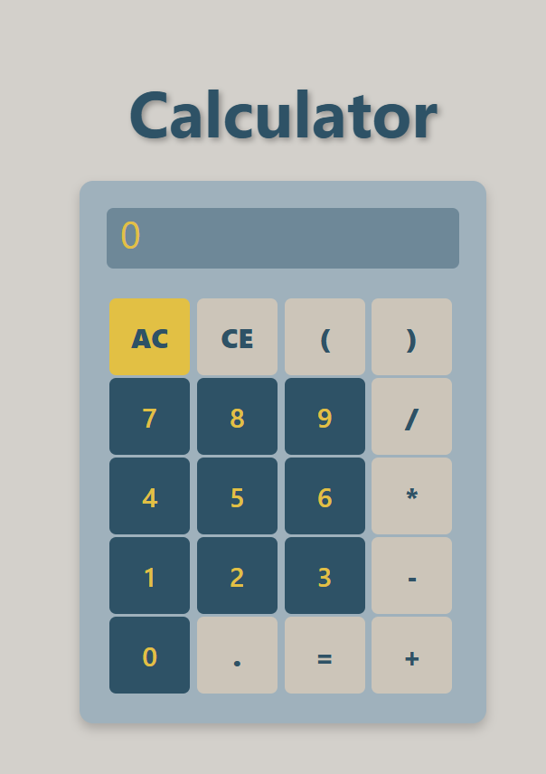

# 🧮 JavaScript Calculator — Built Without eval()

A fully functional calculator built using **HTML**, **CSS**, and **Vanilla JavaScript**.

Unlike most beginner calculator projects, this calculator **does not use JavaScript's `eval()`**. Instead, it implements a custom expression parser and evaluator from scratch to understand how mathematical expressions are processed internally.

---

## 📸 Preview



---

---

## ✨ Features

- 🔢 Tokenizes mathematical expressions
- ➕ Supports Addition, Subtraction, Multiplication & Division
- 📐 Handles Parentheses with correct evaluation order
- ➖ Supports Unary Minus (`-5`, `(-3+2)`)
- ✖️ Implicit Multiplication (`2(3+4)`, `(2+3)(4+5)`)
- 🎯 Correct Operator Precedence (BODMAS)
- ⌨️ Keyboard Support
- 🖱️ Mouse Input
- 🔹 Decimal Number Support
- ✅ Input Validation
- ⚠️ Error Handling
- ⌫ Backspace Functionality
- 🧹 Clear & All Clear Operations

---

## 🧠 How It Works

The calculator evaluates expressions using the following pipeline:

```
User Input
     │
     ▼
Validate Expression
     │
     ▼
Check Balanced Parentheses
     │
     ▼
Tokenize Input
     │
     ▼
Handle Unary Minus
     │
     ▼
Handle Implicit Multiplication
     │
     ▼
Evaluate Parentheses
     │
     ▼
Solve Multiplication & Division
     │
     ▼
Solve Addition & Subtraction
     │
     ▼
Display Result
```

---

## 📂 Project Structure

```
text
CALCULATOR-WITHOUT-EVAL/
│
├── assets/
│   └── calculator-preview.png
│
├── index.html
├── index.js
├── style.css
└── README.md
```


---

## 💡 Why Not `eval()`?

Using `eval()` would make the calculator extremely short, but it hides all the interesting logic behind expression evaluation.

This project was built to learn:

- Tokenization
- Expression Parsing
- Operator Precedence
- Parentheses Evaluation
- Unary Operators
- Expression Reduction

rather than relying on JavaScript's built-in evaluator.

---

```md
## 🚀 Future Version

The next version of this project will focus on improving the parser architecture by implementing a Recursive Descent Parser.

Planned additions:

- Recursive Descent Parser
- Exponentiation (`^`)
- Modulus (`%`)
- Scientific Functions
- Calculation History
- Theme Switching
- Memory Operations


## 🛠️ Built With

- HTML5
- CSS3
- Vanilla JavaScript (ES6)

---

## 📚 What I Learned

Building this project helped me understand:

- Breaking a problem into smaller parts
- Designing a tokenizer
- Handling edge cases
- Implementing operator precedence
- Parsing nested parentheses
- Thinking beyond built-in functions like `eval()`

It also introduced me to more advanced parsing techniques like **Recursive Descent Parsing**, which I plan to implement in a future version.

---


## 🌐 Live Demo

Coming Soon...

## 🤝 Feedback

Suggestions, improvements, and pull requests are always welcome!

If you have ideas to improve the parser or calculator, feel free to open an issue or contribute.

---


## ✅ Supported Expressions

```text
5+3
12-8
7*4
20/5

(5+3)*2

2(3+4)

(-5+2)

((2+3)*4)-5

12.5+7.5

⭐ If you found this project interesting, consider giving it a star.